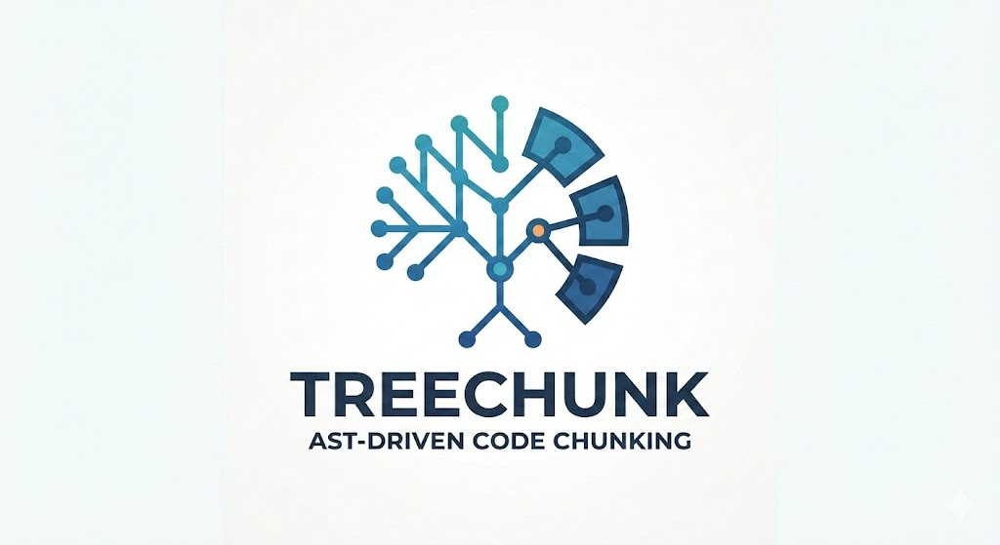

# 🌳 TreeChunk

<p align="center">
  
</p>

<p align="center">
  
  
  
</p>

---

## 🚀 O que é a TreeChunk?

**TreeChunk** é uma biblioteca open source em TypeScript projetada para resolver um dos desafios fundamentais em LLMs (Large Language Models) e RAG (Retrieval-Augmented Generation): a **fragmentação inteligente de código-fonte**.

Diferente de divisores de texto genéricos que cortam arquivos aleatoriamente, a TreeChunk utiliza análise sintática para garantir que cada "chunk" (pedaço) de código mantenha seu contexto semântico, respeitando limites lógicos como funções, classes e interfaces.

> [!WARNING]
> **Aviso de Fase Inicial:** O projeto está em fase ativa de desenvolvimento. APIs podem mudar e novos recursos são adicionados semanalmente.

## 🛠️ Suporte Atual e Visão

Atualmente, a biblioteca foca em ecossistemas **JavaScript e TypeScript**, utilizando o compilador oficial do TypeScript para navegar na Árvore de Sintaxe Abstrata (AST).

**Nossa Visão:**
- **Independência de Linguagem:** Evoluir para suportar qualquer linguagem de programação (Python, Go, Rust, Java, etc.) mantendo a precisão semântica.
- **Multiformato:** Implementar chunking estruturado para arquivos de dados e marcação como **PDF, XML, HTML, Markdown** e outros.

## ✨ Funcionalidades

- 🧠 **AST-Based**: Identificação precisa de elementos de código através da Árvore de Sintaxe Abstrata.
- 📏 **Auto-splitting Inteligente**: Divide elementos excessivamente grandes em múltiplos chunks, garantindo que o corte ocorra em pontos lógicos sempre que possível.
- 📊 **Metadados Completos**: Cada chunk inclui nome do elemento, tipo (função, classe, etc.), contagem de caracteres e posições exatas (start/end).
- 📦 **Dual Build**: Suporte nativo para **ESM** e **CommonJS**.
- ⚡ **API Simplificada**: Gere chunks de um projeto inteiro com apenas uma função.

## 📦 Instalação

```bash
npm install treechunk
```

## 💻 Uso Rápido

A forma mais eficiente de utilizar a TreeChunk é através da função orquestradora `generateChunks`:

```typescript
import { generateChunks } from 'treechunk';

async function run() {
  const chunks = await generateChunks({
    rootDir: './src',
    ignoreDirs: ['node_modules', 'dist', '.git'],
    maxChunkSize: 2000 // Tamanho máximo de caracteres por chunk
  });

  console.log(`Gerados ${chunks.length} chunks.`);
  console.log(chunks[0]);
}

run();
```

## 🗺️ Roadmap

- [x] Suporte inicial para TS/JS (Functions, Classes, Interfaces, Enums).
- [ ] Suporte para variáveis globais e objetos complexos.
- [ ] Implementação de parsers para outras linguagens (Python via Tree-Sitter).
- [ ] Suporte para documentos (PDF, XML, HTML).
- [ ] Sistema de plugins para extração customizada.

## 🤝 Contribuindo

Este é um projeto **Open Source** e adoraríamos sua ajuda! Seja reportando bugs, sugerindo funcionalidades ou enviando Pull Requests.

1. Faça um Fork do projeto.
2. Crie uma Branch para sua feature (`git checkout -b feature/nova-funcionalidade`).
3. Commit suas mudanças (`git commit -m 'Adiciona nova funcionalidade'`).
4. Push para a Branch (`git push origin feature/nova-funcionalidade`).
5. Abra um Pull Request.

## 📄 Licença

Distribuído sob a licença MIT. Veja `LICENSE` para mais informações.
